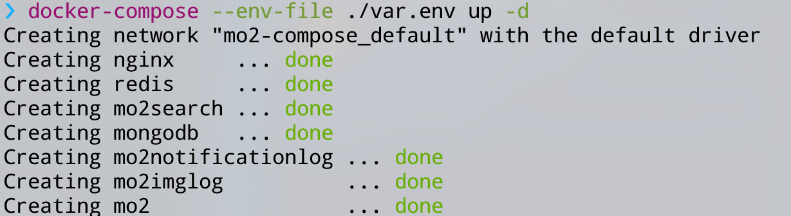
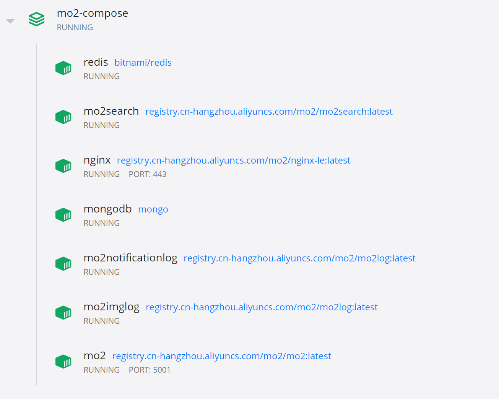
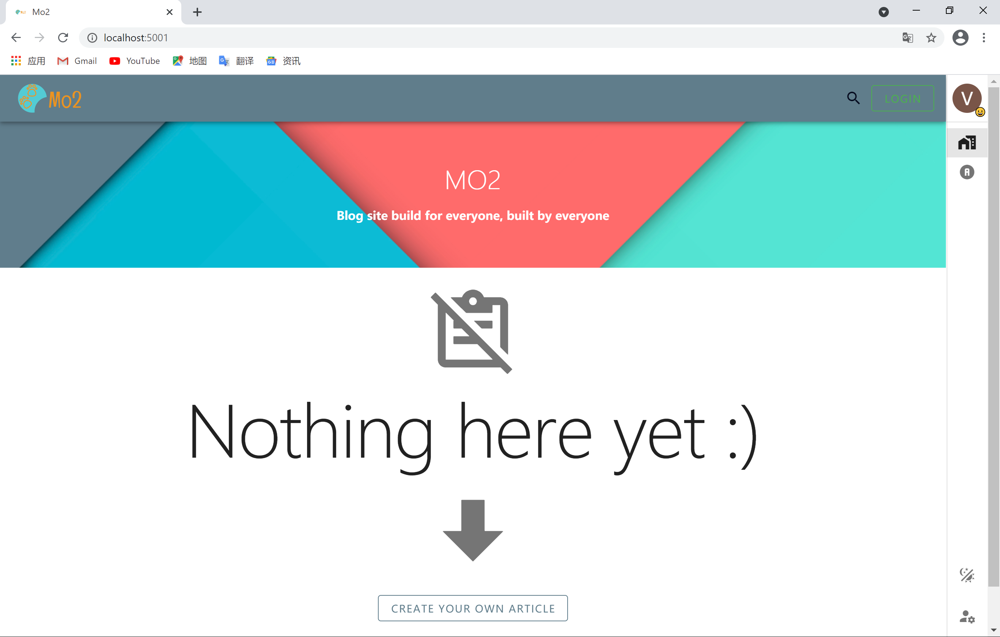

# Mo2-compose
用来启动Mo2的~~docker-compose~~k8s配置文件  
自2021/5/8日起，mo2的生产环境由docker compose升级为k8s  
## Architecture

## 如何使用（已过时）
如果你只是想运行或部署Mo2项目而不对他的源码感兴趣，使用docker无疑是你最好的选择。  
- 首先，你需要安装[docker](https://docs.docker.com/engine/install/)以及[docker-compose](https://docs.docker.com/compose/install/)  
- 然后，你需要clone此项目
- 在此项目目录打开命令行，执行命令`docker-compose build`
- 打开目录下的var.env.example文件，修改配置为你的配置，然后另存为var.env文件
- 最后，执行命令`docker-compose --env-file ./var.env up -d`即可，此时将可以通过 http://localhost:5001/swagger/index.html 访问后端控制台，如果你成功设置了七牛，则可以通过 http://localhost:5001 访问前端

> **注意** 部分环境变量不正确可能不会影响后端运行，但可能导致后端部分功能不能使用。包括：
> - image upload相关功能
> - email发送相关功能
> - 自动ssl
> - 前端页面  
> 
> 目前除了项目所有者，其他人不能用docker-compose直接启动前端。如果想看前端，可以参考[Mo2](https://github.com/Monkey-Mouse/Mo2)里的从源码运行前端的方式

运行情况截图：  
  
  

